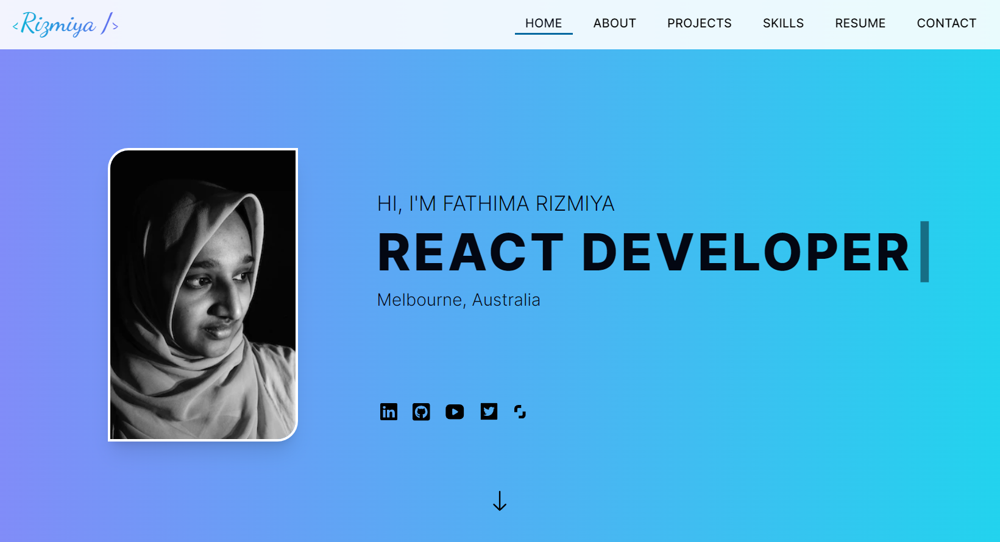

# Rizmiya's Portfolio Website

Welcome to my portfolio website built using React & Next.js (with App Router), TypeScript, Tailwind CSS, Framer Motion, and hosted on Vercel.

## Overview

This portfolio website showcases my projects, skills, and experience in web development. It's built with modern web technologies to provide a smooth and engaging user experience.

## Technologies Used

- React & Next.js (App Router)

- TypeScript

- Tailwind CSS

- Framer Motion: Framer Motion is used to add animations and transitions, enhancing the user interface.

- Resend: Resend is integrated to handle email functionality for the contact form on the website.

- Vercel Hosting: The website is hosted on Vercel, ensuring fast and reliable performance.

## Features

- Responsive design to ensure a seamless experience across different devices.
- A clean and modern user interface.
- Integration of animations using Framer Motion.
- Hosting on Vercel for fast and reliable performance.

## Live Demo

You can view the live version of the website here: [Rizmiya's Portfolio](https://rizmiya-portfolio.vercel.app/)

